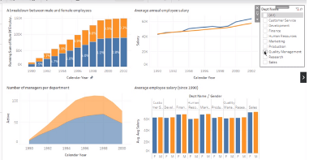

# Gender-Based Salary Analysis using SQL and Tableau

## Introduction

This project examines gender discrepancies in salaries within a company, leveraging the power of SQL for data extraction and Tableau for visualization. The analysis uses a modified version of the familiar 'employees' database, enabling us to focus on intricate Business Intelligence tasks while working with a known dataset.

## Objectives

- Analyze the distribution of male and female employees within the company annually from 1990.
- Compare the number of male and female managers across different departments each year since 1990.
- Evaluate the average salary of male and female employees up to 2002, with department-wise granularity.
- Create an SQL stored procedure to retrieve the average salary of both genders within a user-defined salary range, and visualize this in Tableau.

## Technologies Used

- **Database**: MySQL (employees_mod database)
- **Visualization Tool**: Tableau
- **Languages**: SQL for data extraction and manipulation

## Steps to Reproduce

1. **Set Up the Database**:
   - Download the `employees_mod` database file.
   - Use MySQL Workbench to run the database script, thus setting up the `employees_mod` database.

2. **Data Extraction using SQL**:
   
4. **Visualization in Tableau**:
   - Import the result sets from the SQL queries into Tableau.
   - Create individual visuals for each of the analyses.
   - Organize visuals into a cohesive dashboard, optimizing for clarity and user experience.

## Results

- Created a comprehensive dashboard in Tableau, offering insights into gender disparities within the company's salary structure.
- Identified departments with pronounced gender salary gaps.
- Assessed the gender distribution in managerial roles across the organization.

## Conclusion

This project successfully leveraged SQL and Tableau to shed light on gender-based salary discrepancies within the company. These insights are crucial for addressing potential inequalities and ensuring an inclusive work environment.

## Future Scope

- Integrate more variables, like performance metrics, to understand the complete picture of salary distributions.
- Examine other potential biases in salary, such as race or age.
